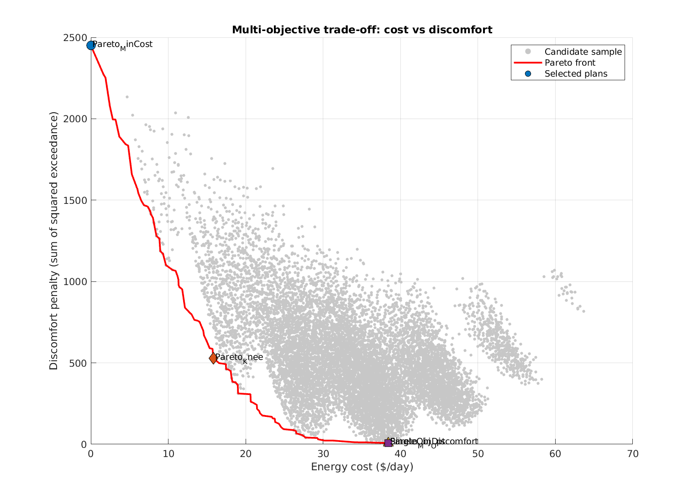
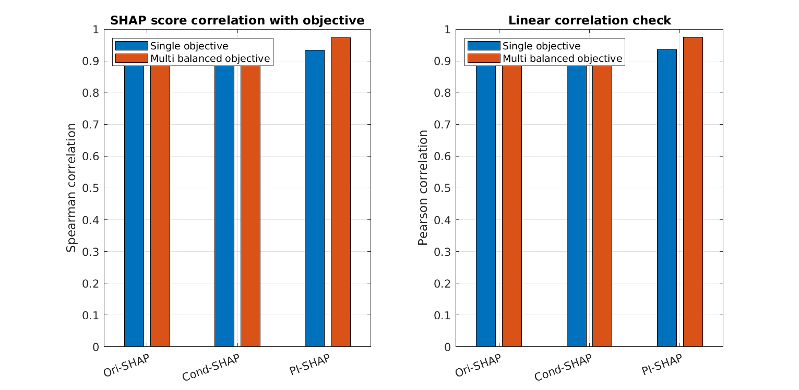
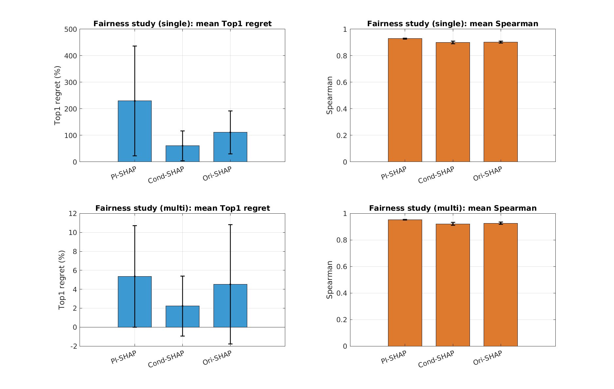

# PI-SHAP Benchmark Repository

This repository contains two reproducible time-series optimization systems:

1. `benchmark_pepeline5C` (gas-network operation benchmark)
2. `benchmark_hvac2zone_seqtree` (public-friendly two-zone HVAC benchmark)

Both include simulation, DOE, single-objective planning, multi-objective planning,
and SHAP-based schedule ranking.

---

## Repository Completeness

- `benchmark_pepeline5C/`
- `benchmark_hvac2zone_seqtree/`
- `REPO_INTEGRITY_CHECK.md`
- `README.md`

Integrity checklist: `REPO_INTEGRITY_CHECK.md`

---

## System A: Gas Pipeline Case (`benchmark_pepeline5C`)

### A.1 State and dynamics

Let $x_t$ be the transient gas-network state (nodal pressures, linepack-related
states, and associated variables), $u_t$ be control decisions, and $d_t$ be
demand/boundary disturbances.

The transient model is represented compactly as:

$$
g(x_{t+1}, x_t, u_t, d_t) = 0, \quad t = 0,\dots,T-1.
$$

### A.2 Single-objective formulation (cost branch)

$$
\min_{u_{0:T-1}} J_{\mathrm{cost}}(u) = \sum_{t=0}^{T-1} c_t\,E_t(u_t,x_t)
$$

subject to core constraints:

$$
Aq_t + s_t - d_t = 0 \quad \text{(nodal balance)}
$$

$$
p_{\min} \le p_{i,t} \le p_{\max}, \qquad q_{\min} \le q_{ij,t} \le q_{\max}
$$

$$
u_{\min} \le u_t \le u_{\max}, \qquad \lVert u_t-u_{t-1}\rVert_\infty \le \Delta u_{\max}
$$

and initialization/terminal feasibility constraints (implemented in solver scripts).

### A.3 Multi-objective formulation

Bi-objective statement:

$$
\min_u \big[J_{\mathrm{cost}}(u),\,J_{\mathrm{supply}}(u)\big].
$$

Reviewer pipeline uses weight scalarization:

$$
\min_u J_w(u)=W_{\mathrm{Cost}}J_{\mathrm{cost}}(u)+W_{\mathrm{Supply}}J_{\mathrm{supply}}(u),
$$

with weight sweep to generate Pareto candidates and evaluate front quality
(HV/IGD/epsilon-style indicators in output tables).

### A.4 Entry points and artifacts

- Main reproduction guide: `benchmark_pepeline5C/reproduction_guidance.md`
- Detailed case doc: `benchmark_pepeline5C/README.md`
- Curated single-objective tables:
  - `benchmark_pepeline5C/modules/performance3/curated/single_objective_cost/tables/`
- Curated multi-objective tables:
  - `benchmark_pepeline5C/modules/performance3/curated/multi_objective_cost_var/tables/`

Example figures:


---

## System B: HVAC 2-Zone Case (`benchmark_hvac2zone_seqtree`)

### B.1 States, controls, disturbances

- States: indoor temperatures $T_{1,t}, T_{2,t}$
- Controls: cooling commands $u_{1,t},u_{2,t}\in[0,1]$
- Disturbances: $T_{\mathrm{out},t}$, solar $S_t$, occupancy $\mathrm{Occ}_{z,t}$,
  and electricity price $\mathrm{Price}_t$
- Horizon: $T=24$ with $\Delta t=1\,\mathrm{h}$
- Planning granularity: 4 blocks $\times$ 6 hours

### B.2 Thermal dynamics

$$
T_{1,t+1}=T_{1,t}+\Delta t\Big[k_{\mathrm{out},1}(T_{\mathrm{out},t}-T_{1,t})
+k_{\mathrm{cross}}(T_{2,t}-T_{1,t})+k_{\mathrm{solar},1}S_t
+k_{\mathrm{occ},1}\,\mathrm{Occ}_{1,t}-k_{\mathrm{cool},1}u_{1,t}\Big]
$$

$$
T_{2,t+1}=T_{2,t}+\Delta t\Big[k_{\mathrm{out},2}(T_{\mathrm{out},t}-T_{2,t})
+k_{\mathrm{cross}}(T_{1,t}-T_{2,t})+k_{\mathrm{solar},2}S_t
+k_{\mathrm{occ},2}\,\mathrm{Occ}_{2,t}-k_{\mathrm{cool},2}u_{2,t}\Big]
$$

Bounds:

$$
0\le u_{z,t}\le 1, \qquad T_{\min}\le T_{z,t}\le T_{\max}.
$$

### B.3 Single-objective scheduling

Power and cost:

$$
P_{z,t}=P^{\max}_z u_{z,t},\qquad
J_{\mathrm{cost}}=\sum_t \mathrm{Price}_t\,(P_{1,t}+P_{2,t})\,\Delta t.
$$

Comfort exceedance penalty:

$$
J_{\mathrm{disc}}=\sum_t\sum_{z\in\{1,2\}}
\max\big(0,|T_{z,t}-T_{\mathrm{set}}|-\delta\big)^2 + w_T\,\phi_T.
$$

Control smoothness:

$$
J_{\mathrm{smooth}}=\sum_t\lVert u_t-u_{t-1}\rVert_2^2.
$$

Optimization objective:

$$
\min_u J_{\mathrm{single}} = J_{\mathrm{cost}} + w_dJ_{\mathrm{disc}} + w_sJ_{\mathrm{smooth}}.
$$

### B.4 Multi-objective scheduling

$$
\min_u \big[J_{\mathrm{cost}}(u),\,J_{\mathrm{disc}}(u)\big].
$$

Pareto points are extracted from the full discrete candidate pool.

### B.5 SHAP schedule ranking protocol

For each target ($J_{\mathrm{single}}$ and a balanced multi target), using identical
plan granularity and split sizes across methods:

- Ori-SHAP
- Cond-SHAP
- PI-SHAP

Evaluation metrics:

- Correlation between SHAP score and negative objective (Spearman/Pearson)
- Top1 regret and Top5 regret
- Multi-split fairness summaries

### B.6 Entry points and artifacts

- Main run: `benchmark_hvac2zone_seqtree/run_benchmark_hvac2zone_seqtree.m`
- Detailed case doc: `benchmark_hvac2zone_seqtree/README.md`
- SHAP conclusions: `benchmark_hvac2zone_seqtree/SHAP_RESULTS.md`
- Auto run summary: `benchmark_hvac2zone_seqtree/outputs/SUMMARY.md`

Example figures:







---

## Run Instructions

### Case A (gas)

See: `benchmark_pepeline5C/reproduction_guidance.md`

### Case B (HVAC)

```matlab
run_benchmark_hvac2zone_seqtree
```

If your environment has OpenGL exit instability:

```bash
MATLAB_DISABLE_HARDWARE_OPENGL=1 matlab -batch "run_benchmark_hvac2zone_seqtree"
```
