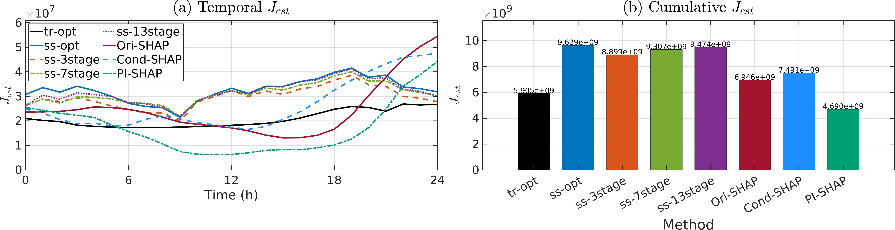
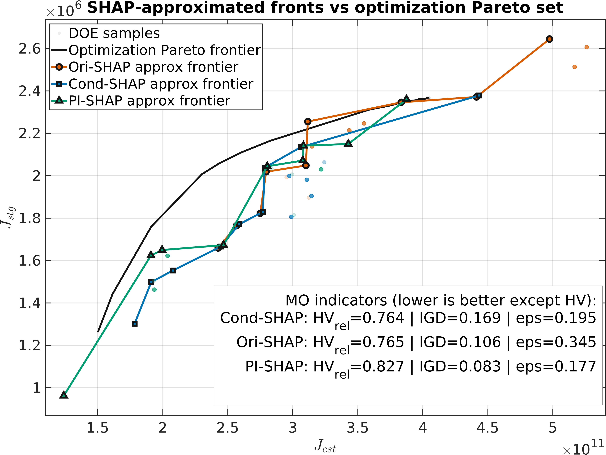

# benchmark_pepeline5C

This is the gas-network PI-SHAP benchmark package used for:

- DOE and transient simulation support,
- single-objective cost scheduling,
- multi-objective trade-off scheduling,
- SHAP-based policy ranking and method comparison.

---

## 1) Mathematical model (compact)

Let $x_t$ be the transient network state, $u_t$ control actions, and $d_t$ boundary
disturbances at time step $t$.

The transient gas model is handled in compact DAE form:

$$
g(x_{t+1},x_t,u_t,d_t)=0,\qquad t=0,\dots,T-1.
$$

with physics/operation constraints enforced by simulation and optimization modules:

$$
Aq_t+s_t-d_t=0
$$

$$
p_{\min}\le p_{i,t}\le p_{\max},\qquad q_{\min}\le q_{ij,t}\le q_{\max}
$$

$$
u_{\min}\le u_t\le u_{\max},\qquad \lVert u_t-u_{t-1}\rVert_\infty\le \Delta u_{\max}.
$$

---

## 2) Optimization formulations

### 2.1 Single objective (cost)

$$
\min_u J_{\mathrm{cost}}(u)=\sum_{t=0}^{T-1} c_tE_t(u_t,x_t)
$$

This is the `Jcost` branch used by the single-objective comparison tables.

### 2.2 Multi objective

$$
\min_u\big[J_{\mathrm{cost}}(u),J_{\mathrm{supply}}(u)\big]
$$

Weight-sweep scalarization used in reviewer scripts:

$$
\min_u J_w(u)=W_{\mathrm{Cost}}J_{\mathrm{cost}}(u)+W_{\mathrm{Supply}}J_{\mathrm{supply}}(u).
$$

---

## 3) Folder responsibilities

- `code/`: core simulator and compact helper wrappers.
- `modules/doe/`: action DOE and DOE-to-simulation chain.
- `modules/sim/`: convergence and simulation studies.
- `modules/shap_vs_nn/`: NN + SHAP support pipeline.
- `modules/performance_shared/`: shared performance/scoring logic.
- `modules/performance3/`: single/multi branch scripts and curated outputs.
- `release/`: release-facing figure/table views.
- `tools/`: view refresh and table-path normalization utilities.

---

## 4) Main run/reproduction references

- Reproduction guide: `reproduction_guidance.md`
- Single-objective curated tables:
  - `modules/performance3/curated/single_objective_cost/tables/`
- Multi-objective curated tables:
  - `modules/performance3/curated/multi_objective_cost_var/tables/`

---

## 5) Core outputs to inspect

- `modules/performance3/curated/single_objective_cost/tables/single_cost_table_top1_s020_baseline.csv`
- `modules/performance3/curated/multi_objective_cost_var/tables/multi_branch_table_top1_s020_baseline.csv`
- `modules/performance3/curated/multi_objective_cost_var/tables/multi_branch_table_summary.csv`

---

## 6) Figures

